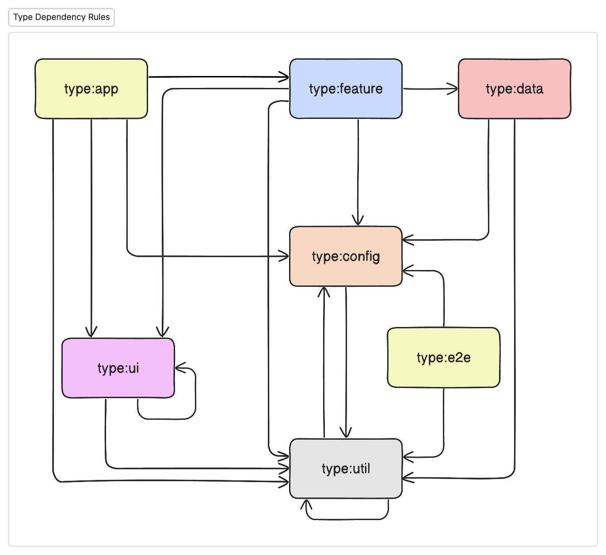
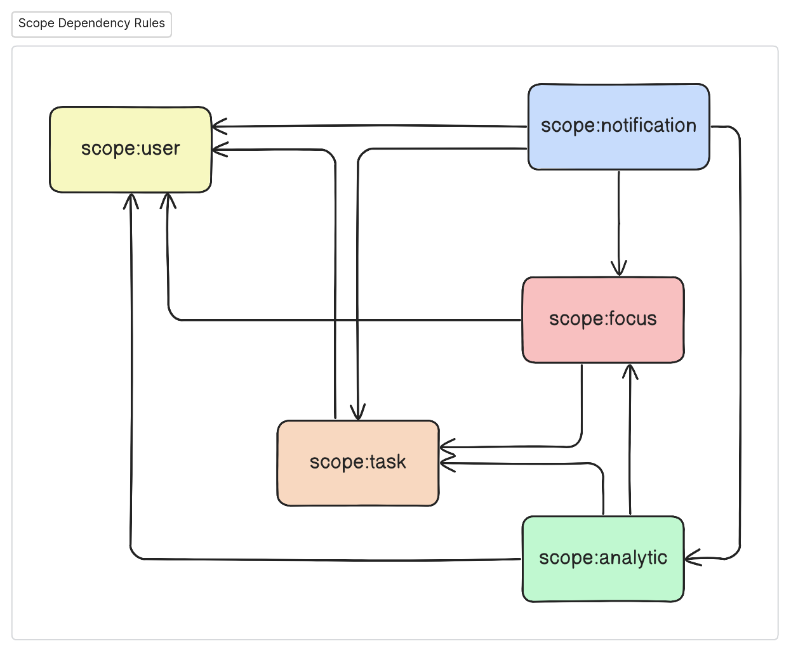

> Where time stops.

# 🌌 The BlackHole App

We often lose sight of our objectives in the space of daily distractions. The BlackHole App is the ultimate tool for productivity and attention. At its core lies the 'Focus Mode' feature, a powerful and immersive experience designed to pull you into a state of deep concentration. With its integrated Pomodoro timer, reward system, background noise, and "Focus Mode" it provides a setting in which distractions disappear into the vacuum.

## 💡 Core Values

* Accessibility First: Keyboard-centric navigation and compatibility with assistive technologies.
* Simplicity & Intuitiveness: Clean and straightforward UI for a hassle-free user experience.
* Adaptability: Evolving with user needs and the latest productivity research.

## Modules

Blackhole defines two properties for each module, `type` and `scope`.

### Type:
The type of a module refers to its technical aspect. It defines the primary function or role of the module in the system. The different types of modules are:

1. `app`: Should be used for Nx applications.
1. `e2e`: Should be used for e2e tests.
2. `feature`: These modules provide specific features or functionalities to the application.
3. `ui`: These modules deal with the visual aspects and user interactions within the application.
4. `util`: These modules provide utility functions or tools that can be used across different parts of the application.
5. `data`: These modules handle data retrieval, and manipulation. They can interact with databases, APIs, or other data sources.

### Scope:
The scope of a module refers to its domain within the project. It defines the primary area or domain the module caters to. The different scopes are:

1. `shared`: Modules that are common and can be used across different parts of the application.
2. `user`: Modules that deal with user-related functionalities like authentication, profile management, etc.
3. `task`: Modules that handle deals with projects, tasks or routines within the application.
4. `focus`: Modules that are deals with keeping user concentrated on a task.
5. `analytics`: Modules that deal with data analysis, reporting, and insights for the user.
6. `notification`: Modules responsible for sending alerts, notifications, or updates to the users.

